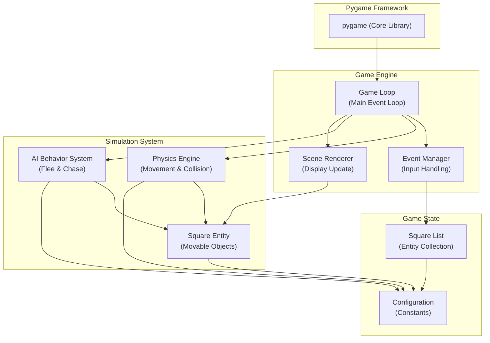
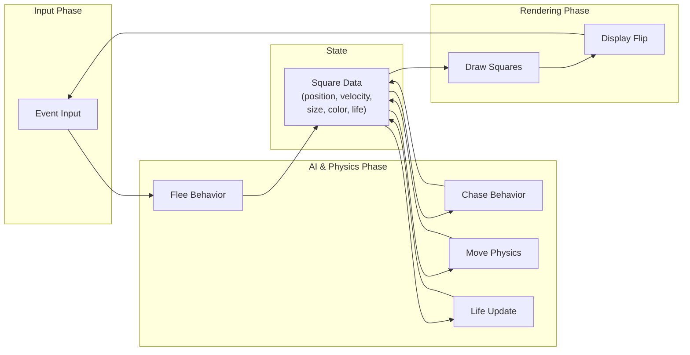
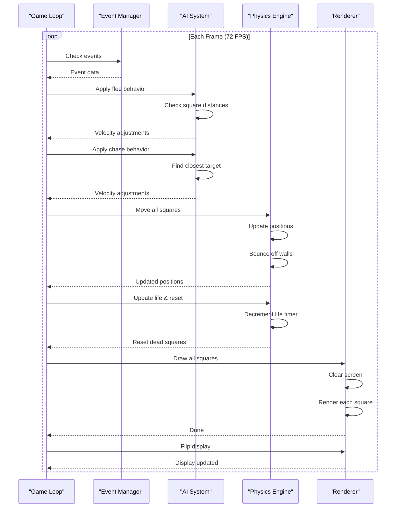

# Pygame Square Simulation - Architecture Documentation

## Project Overview
This is a pygame-based simulation featuring dynamic squares with AI-driven behavior. Squares interact through fleeing and chasing mechanics, creating emergent gameplay where smaller squares flee from larger ones and larger squares hunt smaller targets.

---

## 1. System Architecture Diagram



---

## 2. Class & Function Hierarchy

```mermaid
classDiagram
    class Square {
        -int size
        -float x
        -float y
        -float dx
        -float dy
        -Tuple color
        -float max_speed
        -float life
        
        +reset() void
        +move(dt: float) void
        +flee(all_squares: List, dt: float) void
        +chasing(all_squares: List, dt: float) void
        +update_life(dt: float) void
        +draw(surface: pygame.Surface) void
    }
    
    class "Game State" {
        -List~Square~ squares
        -pygame.Surface screen
        -pygame.time.Clock clock
        -bool running
    }
    
    Game_State --> Square : "contains 15 instances"
```

---

## 3. Data Flow Diagram



---

## 4. Game Loop Sequence Diagram



---

## 5. Component Descriptions

### 5.1 Square Class
**Purpose:** Represents individual entities in the simulation.

**Key Attributes:**
- **Position:** `x`, `y` (pixel coordinates)
- **Velocity:** `dx`, `dy` (pixels per second)
- **Size:** Random value between MIN_SIZE (10) and MAX_SIZE (50)
- **Color:** Random RGB tuple
- **Speed:** Inverse relationship with size (smaller squares are faster)
- **Life:** Countdown timer (5-15 seconds) before reset

**Key Methods:**

| Method | Purpose |
|--------|---------|
| `reset()` | Reinitialize square with random properties |
| `move(dt)` | Update position, handle wall bouncing, apply speed limits |
| `flee(all_squares, dt)` | Flee from larger squares within 200px radius |
| `chasing(all_squares, dt)` | Chase smaller squares within 200px radius |
| `update_life(dt)` | Decrease life counter; reset if expired |
| `draw(surface)` | Render square to screen |

### 5.2 Game Loop
**Purpose:** Main execution pipeline that drives the simulation.

**Flow:**
1. **Event Handling** → Capture quit events
2. **AI Phase** → Apply flee & chase behaviors to all squares
3. **Physics Phase** → Update positions and detect wall collisions
4. **Life Management** → Age squares and reset expired ones
5. **Rendering** → Clear screen, draw all squares, update display
6. **Timing** → Frame-rate control at 72 FPS

### 5.3 Configuration Constants
**Purpose:** Define simulation parameters.

| Constant | Value | Purpose |
|----------|-------|---------|
| `MIN_SIZE` | 10 px | Minimum square dimension |
| `MAX_SIZE` | 50 px | Maximum square dimension |
| `MAX_SPEED` | 200 px/s | Base speed for smallest squares |
| `WIDTH` | 1080 px | Screen width |
| `HEIGHT` | 920 px | Screen height |

---

## 6. AI Behavior Details

### Flee Behavior
- Triggers when a larger square is within 200px radius
- Applies repulsive force proportional to proximity
- Smaller squares always flee from larger ones
- Force calculation: `strength = (200 - distance) / 200`
- Acceleration: `500 * strength` pixels per second

### Chase Behavior
- Finds the closest smaller square within 200px radius
- Applies attractive force toward target
- Only triggers if there is a valid target
- Force calculation: Same as flee (proximity-based)
- Acceleration: `600 * strength` pixels per second (stronger than flee)

---

## 7. Physics System

### Movement
1. Random 2% chance per frame to rotate velocity vector (-0.2 to +0.2 radians)
2. Speed is capped at square's `max_speed`
3. Position updated: `position += velocity * dt`
4. Delta time (dt) enables frame-rate independence

### Collision (Wall Bouncing)
- **Left/Right:** If x < 0 or x > WIDTH, clamp position and reverse dx
- **Top/Bottom:** If y < 0 or y > HEIGHT, clamp position and reverse dy
- No inter-square collisions; only behavioral interaction

### Speed Regulation
- Smaller squares have proportionally higher max speeds
- Calculation: `max_speed = MAX_SPEED * (MAX_SIZE - size) / (MAX_SIZE - MIN_SIZE + 1)`
- Ensures balanced gameplay dynamics

---

## 8. Data Structures

### Square List
```
squares: List[Square]
- Contains exactly 15 Square instances
- Persists throughout game runtime
- Each square is independent but interacts with others via AI
```

### Screen Surface
```
screen: pygame.Surface
- Size: 1080x920 pixels
- Color: Dark gray (30, 30, 30)
- Updated every frame (72 FPS)
```

---

## 9. Key Design Patterns

1. **Entity System:** All game objects (squares) follow the same interface
2. **Separation of Concerns:** AI, physics, and rendering are logically separate
3. **Frame-Rate Independent:** Uses delta time (`dt`) for physics calculations
4. **Behavioral Interaction:** Emergent behavior from simple local rules
5. **Resource Management:** Squares reset and reuse memory rather than creating/destroying

---

## 10. Performance Characteristics

- **Frame Rate:** 72 FPS target
- **Entity Count:** 15 squares (fixed)
- **Update Complexity:** O(n²) for AI (each square checks all others)
- **Draw Complexity:** O(n) for rendering
- **Memory:** Minimal; no allocation/deallocation per frame

---

## Summary

This pygame project implements a lightweight particle system with emergent AI behaviors. The architecture is straightforward:
- **Single Entity Class** (`Square`) manages state and behavior
- **Main Game Loop** orchestrates updates and rendering
- **AI Layer** uses simple distance-based forces for interaction
- **Physics Layer** handles movement and boundary conditions
- **Rendering Layer** draws the current state every frame

The design prioritizes simplicity while demonstrating game loop architecture, physics integration, and AI decision-making.
